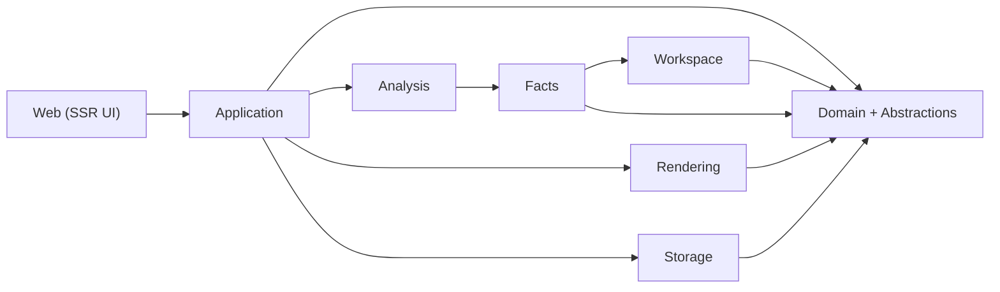
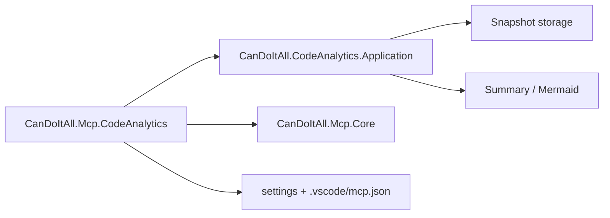

# Architecture blueprint

## Design principles

### 1. Roslyn first, optional enrichers second
The primary pipeline must work without loading target assemblies into an execution context.
Optional enrichers may use compiled metadata later, but the baseline pipeline must already be useful when builds are partial, broken, or unsafe to load.

### 2. Canonical snapshot before pretty diagrams
The snapshot is the product. Mermaid, Markdown, and UI cards are renderers over the snapshot.
Never make a diagram or a summary the only surviving representation of architectural information.

### 3. Facts are not insights
Facts are directly extracted.
Insights are derived from rules and heuristics.
Diagnostics describe gaps, ambiguity, or failures.
These three categories stay distinct in both contracts and storage.

### 4. Host compatibility without host coupling
Design the standalone repo so that future transplantation into the CanDoItAll host repo is straightforward.
That means:
- matching naming and settings conventions where useful,
- keeping the application API transport-agnostic,
- not duplicating `CanDoItAll.Mcp.Core`,
- documenting the future MCP driver seam explicitly.

### 5. Partial failure is acceptable, silent failure is not
If a loader, collector, or renderer cannot resolve something, emit diagnostics and keep going where possible.
No silent omission of unsupported or ambiguous cases.

### 6. SSR-first, JS-light UI
The first UI is an inspection surface, not a front-end framework experiment.
Prefer server-rendered pages, tables, and cards.
Avoid heavy client-side graph tooling.

### 7. Small files and explicit responsibilities
Each project should stay cohesive and each file should do one thing.
Codex may move quickly during implementation, but it must end with a cleanup pass that splits long files, removes catch-all folders, and restores clear boundaries.

### 8. Transport-agnostic application surface
The future MCP driver should wrap application services, not re-implement analysis logic.
The standalone repo should expose operations such as build snapshot, get summary, list exports, and query snapshot data without any MCP-specific envelope.

## Layer model

## Future host-repo MCP shape

