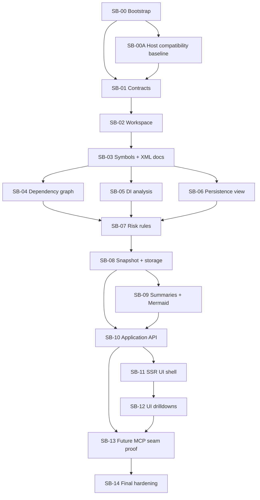

# Execution order and closure evidence

## Dependency flow

## Mandatory closure evidence

Before calling the bundle complete, Codex should be able to point to:

- final build output,
- final test output,
- format / structure / file-length validation output,
- golden files or example outputs for snapshot + Mermaid + summaries,
- proof docs for the future MCP driver seam,
- refactor and review pass results.

## Closure checklist

- all hard gates are green,
- no obvious long-file debt remains,
- no host-core duplication was introduced,
- naming map remains consistent,
- future driver tool/settings surface is frozen,
- the SSR UI proves the engine is navigable,
- the backlog workbook is still aligned with the final scope.
