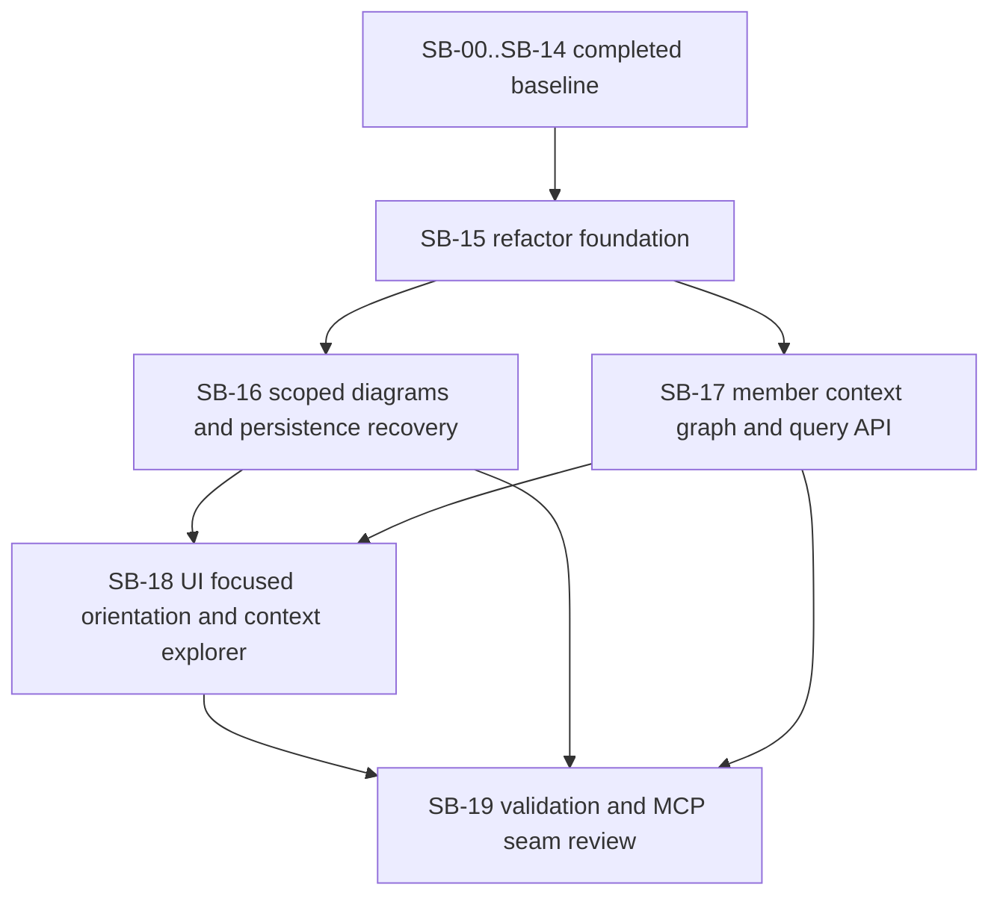

# Phase plan

## Execution Order

1. Confirm the repaired bundle passes the readiness gate.
2. Execute `SB-15-refactor-foundation-and-canonical-ownership`.
3. Execute `SB-16-scoped-diagrams-and-persistence-recovery`.
4. Execute `SB-17-member-context-graph-and-query-api`.
5. Execute `SB-18-ui-focused-orientation-and-context-explorer`.
6. Execute `SB-19-validation-and-mcp-seam-review`.

Completed baseline phases `SB-00` through `SB-14` remain part of the trusted foundation unless they are reopened by a later gate.

## Subbundle Dependency Map

## Critical Subbundles

- `SB-15-refactor-foundation-and-canonical-ownership`
  - Critical foundation because later feature work should not deepen ownership confusion or oversized files.
- `SB-17-member-context-graph-and-query-api`
  - Critical foundation because the value comparison against SharpTools depends on a trustworthy member-level graph.
- `SB-18-ui-focused-orientation-and-context-explorer`
  - Critical foundation for user-facing proof because the new value must be exercisable through the actual UI.

## Phase Gates

| Subbundle | Entry gate | Closure gate | Why it blocks later work |
| --- | --- | --- | --- |
| SB-15 | Bundle repaired, hotspot list confirmed, source-of-truth map accepted | Build and tests pass, file ownership is clearer, no regression in host snapshot generation | Later features would compound poor ownership if this stays weak |
| SB-16 | SB-15 passed | Mermaid renders, host run shows more useful diagrams and persistence relationships | UI and comparison work depend on trustworthy diagram and persistence outputs |
| SB-17 | SB-15 passed | Focused context query returns bounded, source-linked neighborhoods | The whole “save time and context” claim depends on this |
| SB-18 | SB-16 and SB-17 passed | Playwright proves end-to-end context exploration and scoped diagrams | Final comparison must validate real user flow, not only JSON |
| SB-19 | SB-16, SB-17, and SB-18 passed | Full validation matrix and final comparison completed | Closure cannot be trusted without integrated proof |
