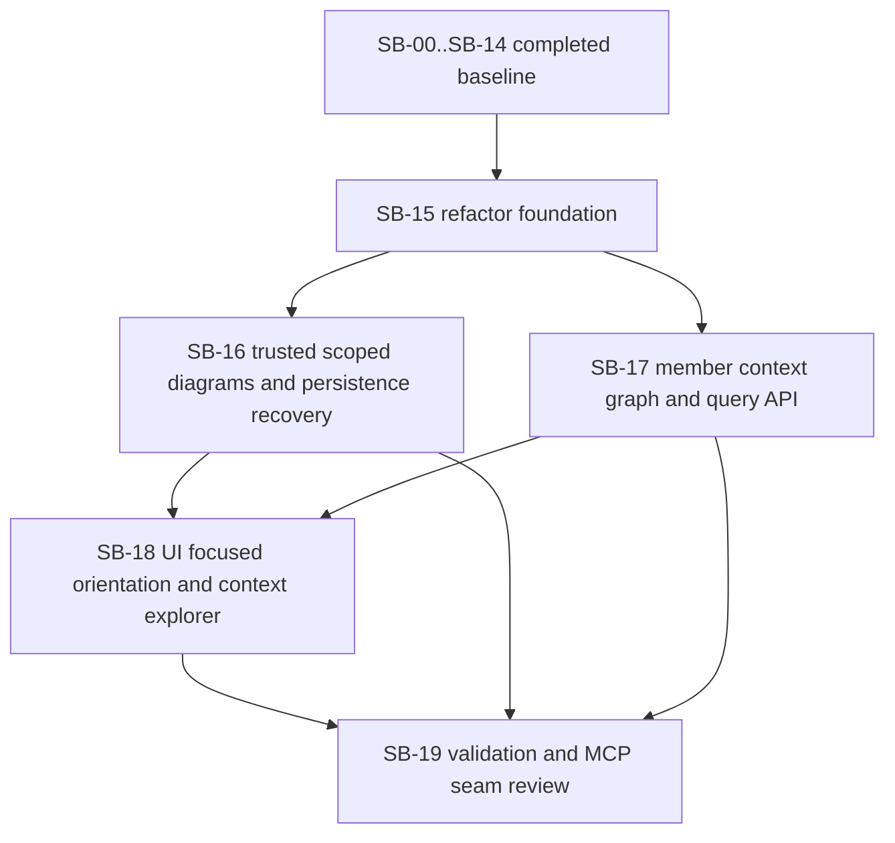

# Phase plan

## Execution Order

1. Confirm the repaired bundle passes the readiness gate.
2. Reopen and execute `SB-15-refactor-foundation-and-canonical-ownership`.
3. Keep `SB-16-scoped-diagrams-and-persistence-recovery` trusted unless new proof contradicts it.
4. Reopen and execute `SB-17-member-context-graph-and-query-api`.
5. Reopen and execute `SB-18-ui-focused-orientation-and-context-explorer`.
6. Reopen and execute `SB-19-validation-and-mcp-seam-review`.

Completed baseline phases `SB-00` through `SB-14` remain part of the trusted foundation unless they are reopened by a later gate.

## Subbundle Dependency Map

## Critical Subbundles

- `SB-15-refactor-foundation-and-canonical-ownership`
  - Critical foundation because later feature work should not deepen ownership confusion or oversized files.
- `SB-17-member-context-graph-and-query-api`
  - Critical foundation because the value comparison against SharpTools depends on a trustworthy member-level graph, seed-resolution path, and excerpt payload.
- `SB-18-ui-focused-orientation-and-context-explorer`
  - Critical foundation for user-facing proof because the new value must be exercisable through the dedicated tuning UI, not only via deep links.
- `SB-19-validation-and-mcp-seam-review`
  - Critical closure foundation in this reopen because the comparison matrix itself is now a required input, not only a final polish step.

## Phase Gates

| Subbundle | Entry gate | Closure gate | Why it blocks later work |
| --- | --- | --- | --- |
| SB-15 | Bundle repaired, hotspot list confirmed, source-of-truth map accepted | Build and tests pass, file ownership is clearer, no regression in host snapshot generation | Later features would compound poor ownership if this stays weak |
| SB-16 | SB-15 passed | Mermaid renders, host run shows more useful diagrams and persistence relationships | UI and comparison work depend on trustworthy diagram and persistence outputs |
| SB-17 | SB-15 passed and the comparison findings are modeled explicitly | Focused context query no longer fails on duplicate paths, broad seeds are tighter, and representative excerpts replace whole-file spill where possible | The comparison only matters if the engine defects are actually fixed |
| SB-18 | SB-16 trusted and SB-17 passed | Playwright proves the lab shows quality cues for noisy selections without regressing the clean UI case | Final comparison must validate the improved user-facing tuning surface |
| SB-19 | SB-16 trusted, SB-17 passed, and SB-18 passed | The three-case matrix, SharpTools comparison, and final closure all agree on the real tradeoff after the improvement pass | Closure cannot be trusted without rerunning the exact cases that triggered the reopen |
