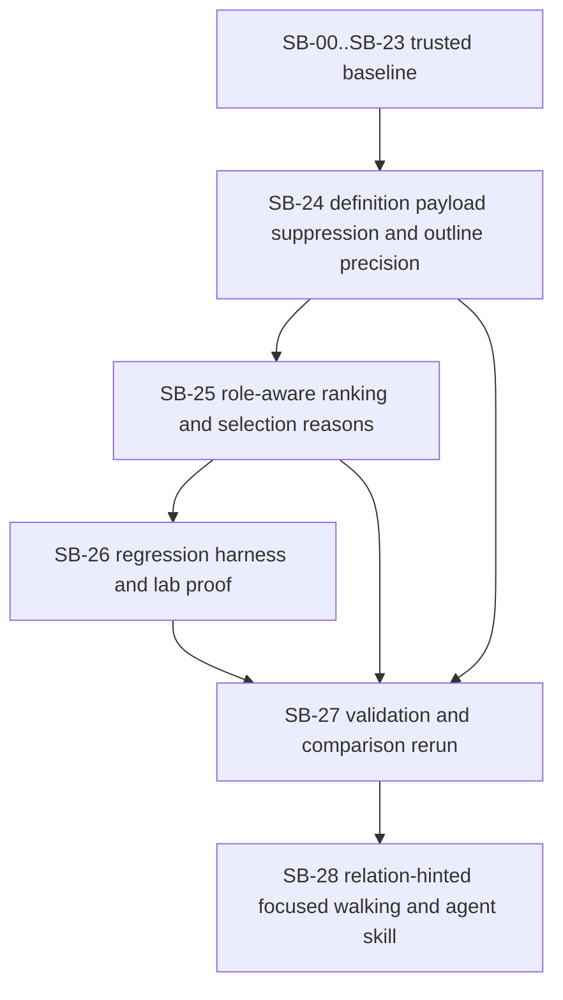

# Phase plan

## Execution Order

1. Confirm the repaired bundle passes the readiness gate. Completed.
2. Keep `SB-00` through `SB-23` trusted unless the new comparison-driven refinement pass exposes weak proof. Completed.
3. Execute `SB-24-definition-mode-payload-suppression-and-outline-precision`. Completed.
4. Execute `SB-25-role-aware-ranking-and-selection-reasons`. Completed.
5. Execute `SB-26-regression-harness-and-lab-proof`. Completed.
6. Execute `SB-27-validation-and-comparison-rerun`. Completed.
7. Execute `SB-28-relation-hinted-focused-walking-and-agent-skill`. Completed.

Completed phases `SB-00` through `SB-23` remain part of the trusted foundation unless they are reopened by a later gate.

## Subbundle Dependency Map

## Critical Subbundles

- `SB-24-definition-mode-payload-suppression-and-outline-precision`
  - Critical foundation because helper payload suppression and the new outline-style precision mode change the core response-shaping contract.
- `SB-25-role-aware-ranking-and-selection-reasons`
  - Critical foundation because infrastructure ranking and selection reasons must stay coherent and strongly typed instead of becoming ad hoc labels.
- `SB-26-regression-harness-and-lab-proof`
  - Critical foundation because the new rerun workflow must become repeatable and the lab must expose the new response shape clearly.
- `SB-27-validation-and-comparison-rerun`
  - Critical closure foundation because this reopen exists specifically to prove the post-implementation position against the same `AppDbContext`, `IClock`, and `CanvasSceneHost` cases.
- `SB-28-relation-hinted-focused-walking-and-agent-skill`
  - Critical tuning foundation because relation hints become the primary way to ask for seed-plus-related-context walks without overloading agent context on large projects.

## Phase Gates

| Subbundle | Entry gate | Closure gate | Why it blocks later work |
| --- | --- | --- | --- |
| SB-24 | Bundle repaired, comparison findings modeled explicitly, trusted baseline confirmed | Helper definition mode suppresses broad consumer excerpts, outline precision exists, and tests cover the new shaping boundary | Later ranking and UI work are too risky if the new payload contract is still unstable |
| SB-25 | SB-24 passed | Role-aware ranking and strongly typed selection reasons work without regressing helper or UI shaping | The lab and rerun are weak if the service cannot explain why items were selected |
| SB-26 | SB-24 and SB-25 passed | Repeatable rerun tooling exists, the lab shows the new response metadata, and browser proof passes | Final comparison is not trustworthy if reruns remain ad hoc |
| SB-27 | SB-24 through SB-26 passed | Build, tests, rerun metrics, and post-implementation comparison agree on the new standing | Closure cannot be trusted without rerunning the exact comparison set that motivated this reopen |
| SB-28 | SB-24 through SB-27 remain trusted and the relation-hint raw input is modeled | Relation hints narrow helper usages, UI and MCP expose the contract, skill guidance matches the tool, and metrics quantify context savings | This is the next context-saving primitive; weak proof would invalidate the new agent workflow guidance |

## Completion note

- All four reopened phases completed on 2026-04-08.
- The tracked rerun path now exists under `tools/ComparisonHarness`.
- The reopen closed with one clear residual risk: `AppDbContext` is more intentional but still slightly broader than the previous focused-context pass.
- The 2026-05-09 reopen added and completed SB-28 for relation-hinted focused walking and agent skill guidance.
- SB-28 reduced the host `IClock` helper scenario from 20 usage clusters to 1 when the `Workbench` relation hint is supplied, with estimated tokens dropping from 1181 to 821.
