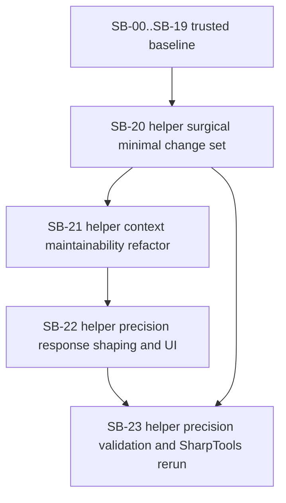

# Phase plan

## Execution Order

1. Confirm the repaired bundle passes the readiness gate.
2. Keep `SB-00` through `SB-19` trusted unless the new helper-precision pass exposes weak proof.
3. Execute `SB-20-helper-surgical-minimal-change-set`.
4. Execute `SB-21-helper-context-maintainability-refactor`.
5. Execute `SB-22-helper-precision-response-shaping-and-ui`.
6. Execute `SB-23-helper-precision-validation-and-sharptools-rerun`.

Completed phases `SB-00` through `SB-19` remain part of the trusted foundation unless they are reopened by a later gate.

## Subbundle Dependency Map

## Critical Subbundles

- `SB-20-helper-surgical-minimal-change-set`
  - Critical foundation because helper precision needs a typed strategy boundary before later improvements can stay coherent.
- `SB-21-helper-context-maintainability-refactor`
  - Critical foundation because helper-mode logic must stay clearly owned instead of becoming another score-tweak cluster.
- `SB-22-helper-precision-response-shaping-and-ui`
  - Critical foundation for user-facing proof because surgical helper output is only useful if the response and lab UI present summaries and excerpts clearly.
- `SB-23-helper-precision-validation-and-sharptools-rerun`
  - Critical closure foundation because this reopen exists specifically to prove helper-mode noise is materially lower and the SharpTools handoff is better defined.

## Phase Gates

| Subbundle | Entry gate | Closure gate | Why it blocks later work |
| --- | --- | --- | --- |
| SB-20 | Bundle repaired, helper-noise findings modeled explicitly, trusted baseline confirmed | Helper seeds can switch into a surgical traversal path without regressing database and UI defaults | Later refactor and response shaping are too risky if the minimal helper mode is still fuzzy |
| SB-21 | SB-20 passed | Strategy ownership is clearer, tests pass, and helper-mode logic no longer depends on tangled condition clusters | Broader helper-mode work should not deepen ownership confusion |
| SB-22 | SB-21 passed | Helper outputs show implementations, sampled or summarized usages, and clear UI presentation with Playwright proof | Final comparison only matters if the user-facing helper result is understandable |
| SB-23 | SB-20 through SB-22 passed | Helper rerun, SharpTools comparison, and final closure agree on the reduced-noise tradeoff | Closure cannot be trusted without rerunning the exact helper problem that triggered this reopen |
