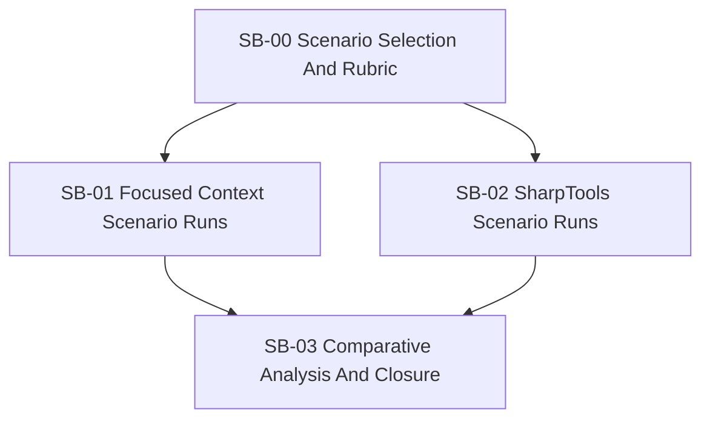

# Phase plan

## Execution Order

1. Validate the comparison bundle structure and freeze the rubric.
2. Run focused-context evidence for the three chosen scenarios.
3. Run SharpTools evidence for the same scenarios.
4. Normalize metrics and write the comparative findings.
5. Close the bundle with updated tables and final validation.

## Subbundle Dependency Map

## Critical Subbundles

- `SB-00` is critical because scenario drift or a weak rubric makes every later comparison less trustworthy.
- `SB-03` is critical because it owns the normalized conclusion instead of raw evidence fragments only.

## Phase Gates

| Phase | Entry gate | Closure gate |
| --- | --- | --- |
| `SB-00` | Raw request and measurement goal are understood | Three scenarios and one comparison rubric are frozen |
| `SB-01` | Scenario list is frozen | Focused-context outputs, timings, and browser proof are captured |
| `SB-02` | Scenario list is frozen | SharpTools outputs, timings, and call counts are captured |
| `SB-03` | Both evidence subbundles are complete | Final comparison tables, note closure, and completed validation all pass |
