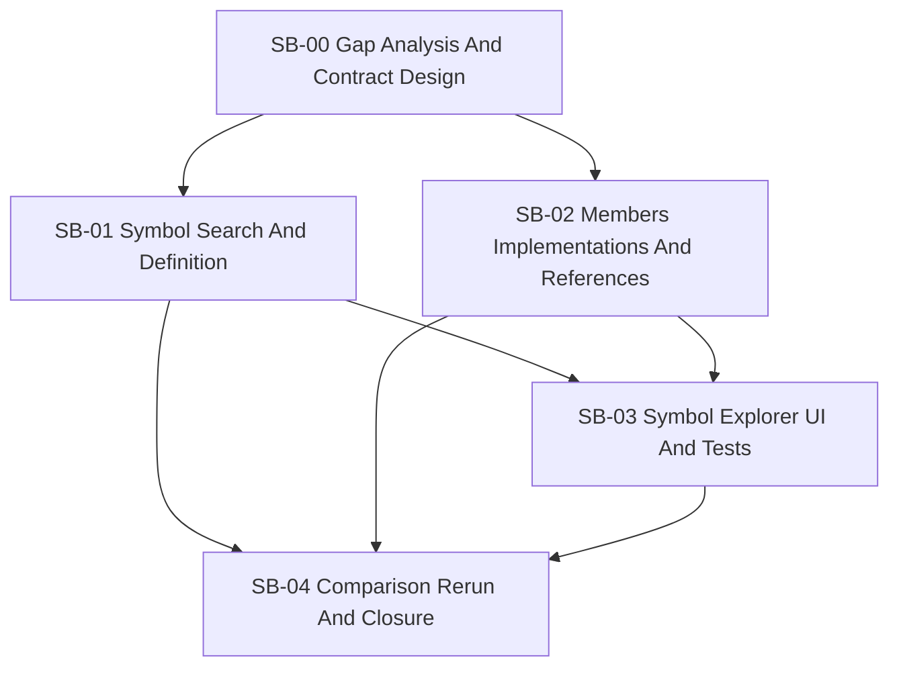

# Phase plan

## Execution Order

1. Freeze the missing tool set and response contracts.
2. Implement symbol search and exact definition viewing.
3. Implement members, implementations, and references.
4. Add the symbol explorer UI and automated coverage.
5. Rerun comparison on the original scenarios plus additional scenarios, then close the bundle.

## Subbundle Dependency Map

## Critical Subbundles

- `SB-00` is critical because weak tool boundaries would create avoidable churn across abstractions, service code, and UI.
- `SB-03` is critical because the user explicitly wants a second information path that can actually be exercised and judged.
- `SB-04` is critical because this work must prove it generalizes beyond the original three scenarios.

## Phase Gates

| Phase | Entry gate | Closure gate |
| --- | --- | --- |
| `SB-00` | Raw request and prior comparison findings are understood | Missing tool list, contracts, and scope limits are frozen |
| `SB-01` | Symbol contracts are frozen | Search and definition work for both types and members with tests |
| `SB-02` | Search and definition are trusted | Members, implementations, and references all return deterministic results with tests |
| `SB-03` | Service-level symbol tools are trusted | UI route, browser proof, and web tests all pass |
| `SB-04` | Product changes and UI proof are complete | Comparison rerun, raw note closure, and completed validation all pass |
