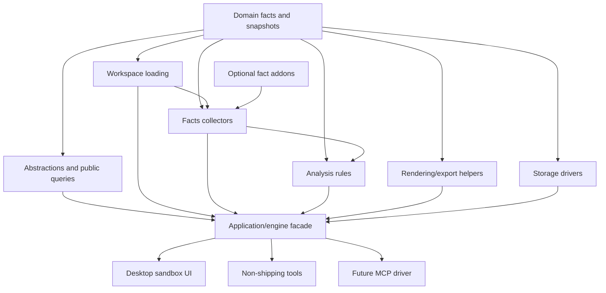

# Target Solution

## Desired Publishing Shape

- Core engine libraries remain transport-agnostic and can be consumed by a future MCP driver, command-line harness, desktop sandbox, or tests.
- Public contracts in `Abstractions` and immutable facts in `Domain` stay small, versionable, and documented.
- Source loading, Roslyn facts, analyzers, rendering, storage, and application orchestration have clear ownership and narrow references.
- The Web project remains a desktop sandbox and is not part of the reusable engine package unless explicitly intended.
- Tools and scenario harnesses stay non-shipping unless a publishing subbundle intentionally packages them.

## Candidate Project Or Package Boundaries

| Candidate | Current source | Purpose | `SB02` decision |
| --- | --- | --- | --- |
| `CanDoItAll.CodeAnalytics.Engine` or keep `Application` | `repo://src/CanDoItAll.CodeAnalytics.Application` | Snapshot build orchestration and stable high-level API. | Keep `Application` as the engine facade for this publishing wave; do not create a rename/facade project now. |
| `CanDoItAll.CodeAnalytics.FocusedContext` | `repo://src/CanDoItAll.CodeAnalytics.Application/Services/CodeAnalyticsApplicationService.Context*.cs` | Focused-context seed resolution, strategy, scoring, selection, and excerpts. | Extract internal Application services in `SB03`; defer a separate project until reuse outside the engine facade exists. |
| `CanDoItAll.CodeAnalytics.SymbolQueries` | `repo://src/CanDoItAll.CodeAnalytics.Application/Services/CodeAnalyticsApplicationService.Symbols*.cs` | Symbol search, definitions, references, and source excerpts. | Extract internal Application services in `SB03`; keep the public API behind `ICodeAnalyticsApplicationService`. |
| `CanDoItAll.CodeAnalytics.Facts.EfCore` | `repo://src/CanDoItAll.CodeAnalytics.Facts/Persistence` | EF-specific DbContext/entity/model-snapshot analyzer addon over the engine. | Keep under `Facts` in `SB04`, but design as the first future optional fact addon. |
| `CanDoItAll.CodeAnalytics.Facts.DependencyInjection` | `repo://src/CanDoItAll.CodeAnalytics.Facts/Services` | DI registration facts and diagnostics. | Keep under `Facts`; no separate addon until configurable fact packs exist. |
| `CanDoItAll.CodeAnalytics.Storage.FileSystem` | `repo://src/CanDoItAll.CodeAnalytics.Storage` | File-backed snapshots, recent index, exports. | Keep as the current storage driver project; split only after a second storage driver exists. |
| `CanDoItAll.CodeAnalytics.Rendering.Mermaid` | `repo://src/CanDoItAll.CodeAnalytics.Rendering` | Markdown and Mermaid export renderers. | Keep under `Rendering`; package split is future-only. |
| `CanDoItAll.CodeAnalytics.Web.DesktopSandbox` | `repo://src/CanDoItAll.CodeAnalytics.Web` | Large-screen sandbox UI. | Keep non-core, desktop-oriented, and outside reusable engine packages. |
| `CanDoItAll.Mcp.CodeAnalytics` | `repo://reference/compatibility-matrix.md` | Future host driver. | Future host-driver only; do not implement in this repo during publishing hardening. |

## Allowed Dependency Direction

## Refactoring Principles For Execution

- Prefer small internal services before creating new projects; create a project only when it clarifies public ownership, optional dependencies, or driver boundaries.
- Preserve stable IDs, response contracts, export relative paths, and existing test fixtures unless a subbundle explicitly changes them.
- Split large Razor pages into components by workflow surface: run controls, summary, selected files, usage summary, supporting context, symbol details.
- Do not make mobile/medium responsive polish a goal for the sandbox UI.
- Measure performance before replacing LINQ in readable non-hot paths.
- Use semantic proof for critical foundations: shallow-pass trap, adversarial negative proof, semantic positive proof, anti-stub audit, and raw-note closure.
