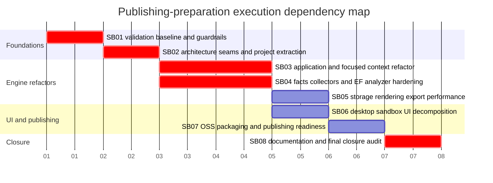

# Phase Plan

## Phase Sequence

1. `SB01` makes validation runnable and records a trustworthy release baseline.
2. `SB02` decides project seams and extraction boundaries before code movement.
3. `SB03` refactors application/focused-context/symbol responsibilities behind stable contracts.
4. `SB04` hardens facts collectors and EF analyzer behavior, including any addon split.
5. `SB05` applies evidence-backed storage, rendering, export, and query performance hardening.
6. `SB06` decomposes desktop sandbox UI and validates large-screen behavior.
7. `SB07` adds OSS packaging, metadata, license/security/release policy, and publish validation.
8. `SB08` updates documentation based on shipped changes and performs final closure.

## Subbundle Dependency Map

## Critical Subbundles

- `SB01` Critical foundation: validation baseline, test reliability, and guardrail scripts. Requires artifact-backed proof manifest `bundle://proof/SB01/manifest.md`.
- `SB02` Critical foundation: architecture seams and extraction decisions. Requires manifest `bundle://proof/SB02/manifest.md` plus an ADR or architecture decision artifact.
- `SB03` Critical foundation: application/focused-context behavior. Requires manifest `bundle://proof/SB03/manifest.md` and semantic invariant contract for symbol and focused-context behavior.
- `SB04` Critical foundation: persistence/EF analyzer behavior. Requires manifest `bundle://proof/SB04/manifest.md` and semantic invariant contract for EF facts and diagnostics.
- `SB08` Critical closure: docs and raw input closure. Requires manifest `bundle://proof/SB08/manifest.md` and final verifier/red-team artifact.

## Phase Gates

- Prepared gate: run `python C:\Users\dell\.codex\skills\candoitall-bundle-preparation\scripts\validate_bundle.py CanDoItAll.CodeAnalsis.PublishPrepBundle --profile initiative --stage prepared --repo-root .` and repair failures before implementation.
- Entry gate for every subbundle: confirm prerequisites, source references, current branch state, and open blockers in the subbundle README.
- Closure gate for every subbundle: update `reviews/01-execution-report.md`, capture command transcripts, update acceptance checklist, and record progression result.
- Critical subbundle semantic gate: provide shallow-pass trap, adversarial negative proof, semantic positive proof, anti-stub audit, raw-note literal closure, changed-file hashes, and portable proof manifest.
- UI gate: for `SB06`, use a desktop-large browser viewport first; small/medium tuning is out of scope unless required to fix a regression introduced by desktop changes.
- Final gate: run build, tests, guardrail scripts, package validation, browser proof review, final docs review, raw-note closure, and completed-stage validator.
